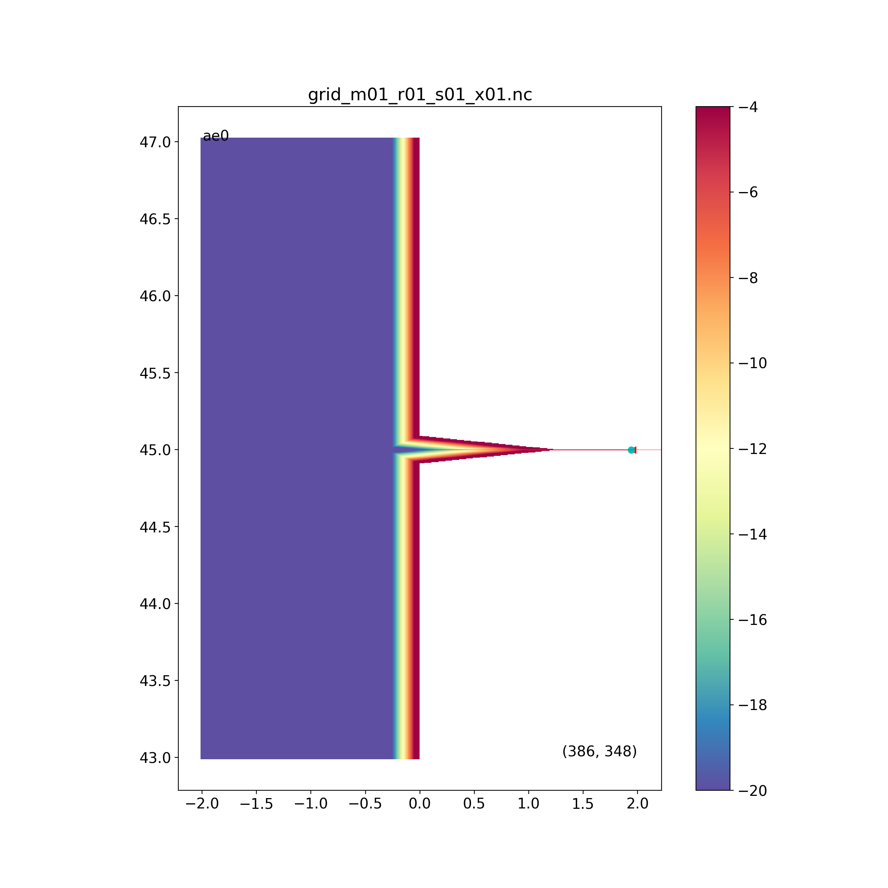

# Analytical (idealized) ROMS simulations

### These are step-by-step directions to guide a new member of the UW Coastal Modeling Group in doing their own ROMS modeling in idealized configurations.

We will be using the LO system of programs, written in python, and you will be working across three separate computers:

1. Your laptop: This is where you will do all your code development, including grid generation.
2. One of our linux machines like perigee or apogee: This is where you will make the forcing files to run ROMS, and where the output will end up.
3. One of the UW hyak supercomputers like mox or klone: This is where the actual ROMS computation is done, making use of the fast parallel nodes we own.

You will be putting your own python installations on some of these, and using GitHub to clone various code repositories to all of them.  It is pretty complicated, but I hope it will be worth the effort. The goal is to arrive at a system that allows you to make effective use of our computing resources, and to make a flexible system for building and analyzing your own ROMS simulations.

### STEPS

#### Install python, the loenv environment, and the LO and LO_user repos

Install python and the LO code repo on your laptop. Even if you already have a python installation this should not interfere with what you have because we will use an environment. Follow the directions [HERE](https://github.com/parkermac/LO/blob/main/README.md). Now you have the "loenv" python environment that has access to all the python modules you need, and you have the LO and LO_user code repos.

Note that you will have to create your own repo called `LO_user`, then copy `get_lo_info.py` into it, and edit it with information specific to you. This is the one place where user-specific and machine-specific information is kept.

#### Make the ROMS grid for an analytical run

Now make a grid using the pgrid programs in LO. First make a directory in your LO_user called pgrid, and then copy `LO/pgrid/gfun_user.py` into `LO_user/pgrid/gfun_user.py` and check that the "ae0" grid is the one it is working on. Around line 19 you should see:
```
gridname = 'ae0'
```
and if not, then edit it to make it so. This is an idealized estuary + coast domain that looks like this: . You can look farther down in the code and see how this is generated.  Note that we also create a little pandas DataFrame with info about a river called "creek0", and some track info.

To make this grid yourself, go to `LO/pgrid`, launch ipython, and run these commands in order:
- start_grid
- make_mask
- carve_rivers
- smooth_grid
- make_extras
- grid_to_LO

And using plot_grid you should be able to generate the figure above.  When you run each command you are presented with a list of possible grid iterations to work on; by hitting return each time you choose the last iteration, which is almost always what you want to do. There is a detailed README in pgrid to help with what each step is doing. One thing we did not do in the case was run edit_mask.  For realistic runs getting the mask to match the coastline needs some user attention, but in this case it is not needed.

You may notice along the way that the code made new directories on your computer: `LO_data/grids/ae0` and `LO_output/pgrid`. These are instances of the general [organizing structure](http://faculty.washington.edu/pmacc/Research/new_ideas.html) I use for all projects:

[Data] -> [Code] -> [Output]

#### Repeat some steps on a remote linux machine

Get an account on perigee or apogee from David Darr.  Then, working in the main directory he makes for you (e.g. /dat1/[username], not in your $HOME directory ~) again install python and the LO (clone from parkermac) and LO_user (clone from your GitHub account) repos.

Then copy LO_data/grids/ae0 from your laptop to the remote machine.  You could use scp for this, or I like the Transmit program from the App store, but it is $25 per year.

#### Create the forcing files for a run

Working on the remote machine, go to `LO/driver` and execute these three commands from the linux command line (sequence doesn't matter):
```
python driver_forcing3.py -g ae0 -0 2020.01.01 -1 2020.01.02 -f rivA0
python driver_forcing3.py -g ae0 -0 2020.01.01 -1 2020.01.02 -f ocnA0
python driver_forcing3.py -g ae0 -0 2020.01.01 -1 2020.01.02 -f tideA0
```
These will make files in `LO_output/forcing/ae0/f2020.01.01` and `f2020.01.02`. These are the NetCDF files ROMS will need to force the run for two days.

#### Run ROMS on klone

Get an account on the hyak supercomputer klone from David Darr.

In your main directory /gscratch/macc/[username] = (*) clone the LO (from parkermac), LO_user (from your GitHub account), and LO_roms_source_alt (from parkermac) repositories.

Also make your own repo called LO_roms_user, and copy into it the directories from the parkermac repo `LO_roms_user/upwelling` and `LO_roms_user/uu1k`.

There is no need to install python on klone.  It already exists in a basic state.

---

#### Directions are incomplete from this point on...

Get a ROMS user account, and then use svn to put a copy of the ROMS source code onto klone in (*)/LO_roms_source.  See [HERE](https://github.com/parkermac/LO_roms_user/blob/main/README.md) for more detailed info on getting ROMS working on klone.

See if you can run the upwelling case.

Compile uu1k on klone (on a compute node, just as you did for the upwelling case).

Copy the grid file with a command like this:
```
scp -r parker@apogee.ocean.washington.edu:/dat1/parker/LO_data/grids/ae0 .
```

Run the analytical case, from the head node, with a command like this.
```
python3 driver_roms3.py -g ae0 -t v0 -x uu1k -r backfill -s new -0 2020.01.01 -1 2020.01.02 -np 40 -N 40 < /dev/null > ae.log &
```
