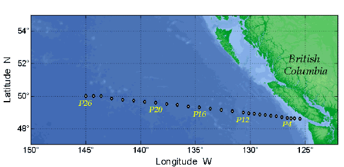

## README for Line P

#### This folder contain specific codes for processing Program Line_P bottle and CTD data in coastal Canadian waters off Vancouver island

---

#### Source

- **Line P** Historic Data collected three times a year at Line P off coastal Canadian waters off Vancouver island.
- Data are publicly available at https://www.dfo-mpo.gc.ca/science/data-donnees/line-p/data-eng.html.  NOTE: NOT complied
  
  - ctd: 1956-2007
  - bottle: 1956-2007
    
- the 2nd method to download data is through: https://www.waterproperties.ca/linep/index.php. NOTE: you need to register first and manualy download year by year. It's NOT complied.
  
  - ctd: 1956-2023 
  - bottle: 1956-2023
  - NOTE: **CTD_oxygen** data was missing before year 2004; **bottle** data from the first two methods only contain nutrients **(e.g., N, P, Si)**. If you want to have CARBON variables **(e.g., DIC, TA)**, try the **3rd** method below

- the 3rd method to download compiled bottle data is through NCEI (Recommended): https://www.ncei.noaa.gov/data/oceans/ncei/ocads/metadata/0234342.html.   NOTE: compiled
  
  - ctd: None
  - bottle: 1990-2019
  

  

Reference:

- Franco, Ana C.; Ianson, Debby; Ross, Tetjana; Hamme, Roberta C.; Monahan, Adam H.; Christian, James R.; Davelaar, Marty; Johnson, William K.; Miller, Lisa A.; Robert, Marie; Tortell, Philippe D. (2021). A compilation of inorganic carbon system and other hydrographic and chemical discrete profile measurements obtained during the fifty five Line P cruises in the Northeast Pacific Ocean over the period from 1990 to 2019 (NCEI Accession 0234342). NOAA National Centers for Environmental Information. Dataset. https://doi.org/10.25921/zrw8-kn24. Accessed 2023-12-30.

- Franco, A. C., Ianson, D., Ross, T., Hamme, R. C., Monahan, A. H., Christian, J. R., et al. (2021). Anthropogenic and climatic contributions to observed carbon system trends in the northeast Pacific. Global Biogeochemical Cycles, 35, e2020GB006829. https://doi.org/10.1029/2020GB006829

---

