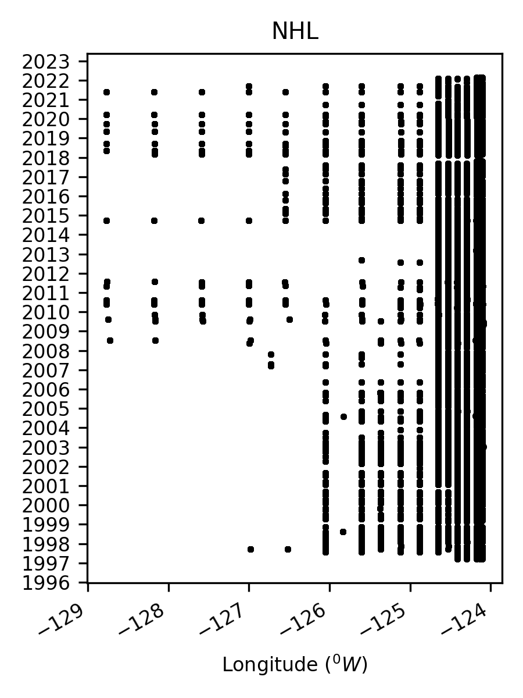

## README for NHL

#### This folder contain two specific codes for processing Newport Hydrography Line since 1997-2021 

---

#### Source

- **NHL** Historic Data collected nearly bi-weekly at Newport Hydrography Line off Oregon using CTD. Data are publicly available at https://doi.org/10.5281/zenodo.5814071  (Select "Newport_Hydrographic_Line_Data_1997_2021.zip" and then select Download)
  
  - bottle None
  - ctd 1997-2021. Missing oxygen data between 1997-July 1998.

  

Reference:

- Risien C.M., M.R. Fewings, J.L. Fisher, J.O. Peterson, and C.A. Morgan (2022). Spatially gridded cross-shelf hydrographic sections and monthly climatologies from shipboard survey data collected along the Newport Hydrographic Line, 1997–2021. Data in Brief, DOI: 10.1016/j.dib.2022.107922.

---

