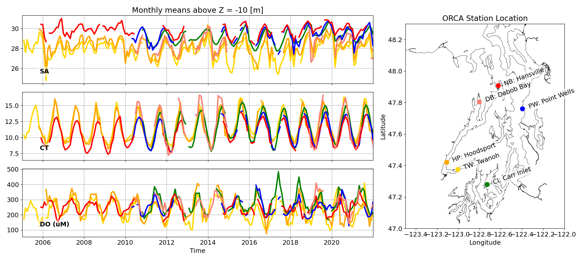
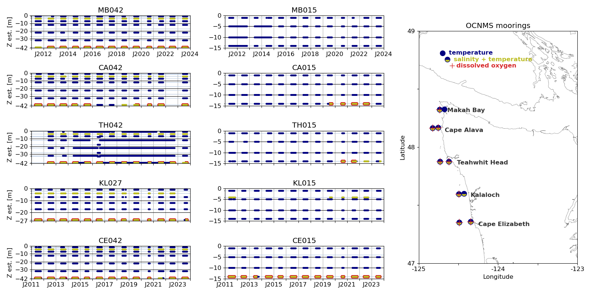

# README for obs

#### These folders contain the highly specific code for processing observations into LO-standardized formats that can be used for model validation and other analysis tasks.

---

## Organization

#### Naming Notes
- [source] is some string identifier of the database, e.g. 'dfo', which is then further identified by
- [otype] observation type, e.g. 'ctd', 'bottle', or 'moor', and finally by
- [year] e.g. 2017.


#### Input/Output file naming conventions
- Input: LO_data/obs/[source]/.csv, .xls, etc.
- Code: LO/obs/[source]/process_ctd_bottle.py or whatever is called for
- Output: LO_output/obs/[source]/[otype]/[year].p and info_[year].p or whatever is called for

---

## CTD and Bottle output conventions

#### info_[year].p is a pickled DataFrame that has (x,y,t) for each cast in that year, with

**index** = cid: a unique number or string that identifies a single cast in the corresponding ctd or bottle DataFrame

**columns**:
- lon [degrees -180:180]
- lat [degrees -90:90]
- time [datetime UTC]
- name [station name or None]
- cruise [cruise name if available]

#### [year].p is a pickled DataFrame with all the processed data for all the casts.

**index** is just numbers, one for each depth

**columns**:
- 'cid', 'lon', 'lat', 'time', 'name', 'cruise' are IDENTICAL for all rows of a given cast, and correspond to a single row in the info_[year].p DataFrame
- 'z' [z-position in meters, positive up, zero at free surface]
- 'SA' [Absolute Salinity in g kg-1]
- 'CT' [Conservative Temperature in degC]
- 'DO (uM)' [dissolved oxygen in umol L-1 = mmol m-3 = "micro-molar"]
- We also use units of (uM) for NO3, NO2, NH4, PO4, SiO4, TA, and DIC
- 'Chl (mg m-3)' [Chlorophyll a]

Note that we use a sort of cumbersome naming convention for the data columns, including the units explicitly so it is clear what we are dealing with in subsequent use. After we have done more processing I will create a master list of preferred and acceptable variable names.

Here is an example of the contents of one of the ecology_nc DataFrames:

```
       cid cruise                time        lat  ...   NO3 (uM) NH4 (uM)  PO4 (uM)  SiO4 (uM)
0        0   None 2023-02-08 19:56:48  47.276669  ...  28.820000     0.02      2.77  56.820000
57       0   None 2023-02-08 19:56:48  47.276669  ...  29.270000     0.17      2.78  57.240002
192      0   None 2023-02-08 19:56:48  47.276669  ...  29.200001     0.21      2.84  58.200001
195      1   None 2023-02-08 21:09:20  47.264999  ...  28.610001     0.09      2.85  61.189999
212      1   None 2023-02-08 21:09:20  47.264999  ...  28.820000     0.17      2.84  62.160000
...    ...    ...                 ...        ...  ...        ...      ...       ...        ...
32206  207   None 2023-08-22 17:14:40  47.667000  ...  28.350000     1.13      2.98  50.860001
32225  208   None 2023-09-01 17:16:48  47.091671  ...   1.530000     0.75      2.01  41.230000
32233  208   None 2023-09-01 17:16:48  47.091671  ...   2.120000     0.92      2.14  41.619999
32496  209   None 2023-09-01 18:57:04  47.264999  ...  12.110000     4.76      2.31  36.150002
33060  210   None 2023-09-01 18:05:52  47.213329  ...   4.820000     3.48      2.25  44.509998
```

#### Sources that have been processed up to these specifications

Note: After you download these to your laptop you can get a quick look at the data by running LO/obs/plot_ctd_bottle.py.

Folders on perigee in `/data1/parker/LO_output/obs` and on apogee in `/dat1/parker/LO_output/obs`:

- **dfo1** Canadian data from a large database created by Susan Allen's group. The original data came from: https://data.cioospacific.ca/erddap/index.html. This replaces the older "dfo" that was parsed from an SQL database.
  - bottle 1930-2021 with gaps in the early years, has some Chl data
  - ctd 1965-2021

- **ecology_nc** Department of Ecology monthly repeat station data. Covers 1999-2023 for both bottle and ctd casts. 200-400 casts per year, monthly at up to ~50 stations in Puget Sound and the coastal estuaries. See the README in the associated folder for details. NOTE: this replaces the "ecology" source what was originally here.
  - bottle and ctd 1999-2023

- **nceiSalish** Data from WOAC and other cruises, mainly in Puget sound and JdF. The original data came from: https://www.ncei.noaa.gov/access/ocean-carbon-acidification-data-system/oceans/SalishCruise_DataPackage.html.
  - bottle 2008-2018, good DIC and TA, 40-199 casts per year
  - ctd None

- **nceiCoastal** Data from WCOA and other North American coastal cruises with carbon data. Good for carbon data on the WA/OR shelf. The original data came from: https://www.ncei.noaa.gov/data/oceans/ncei/ocads/metadata/0219960.html.
  - bottle 2011-2017 and 2021 (2021 processed by Yifan Zhu at U Conn) in the LO model domain, good DIC and TA, 41-56 casts per year
  - ctd None

- **collias** Historic Data collected by Eugene Collias. 368,858 results from the years 1932 until 1975. Data was collected using approximately 15-20 different methods and captures 9 different parameters. Data came from https://apps.ecology.wa.gov/eim/search/Eim/EIMSearchResults.aspx?ResultType=EIMStudyTab&LocationWRIAs=2 (Select the dropdown menu for Collias and then select Download. This triggers an EIM request and eventually they get it to you.) And here is a source of more information: https://apps.ecology.wa.gov/eim/search/Detail/Detail.aspx?DetailType=Study&SystemProjectId=99971885 with links to some great studies.
  - bottle 1932-1975. Missing 1943-1948 and 1973. Good SA, CT and DO, then less for NO3, NO2, and SiO4.
  - ctd None

- **LineP** Historic Data collected three times a year at Line P off coastal Canadian waters off Vancouver island. Processed by Yifan Zhu. See the README in the associated folder for details.
  - bottle 1956-2023 (1990-2019 have carbon variables)
  - ctd 1956-2023

- **nceiPNW** Historic Data collected in Pacific Northwest region by Department of Fisheries and Oceans Canada (DFO). Processed by Yifan Zhu. See the README in the associated folder for details.
  - bottle 1985-2017
  - ctd None

- **NHL** Historic Data collected nearly bi-weekly at Newport Hydrography Line off Oregon using CTD. Data are publicly available at https://doi.org/10.5281/zenodo.5814071  (Select "Newport_Hydrographic_Line_Data_1997_2021.zip" and then select Download). Processed by Yifan Zhu. See the README in the associated folder for details.
  - bottle None
  - ctd 1997-2021. Missing oxygen data between 1997-July 1998.

- **WOD** Historic Data collected in Pacific North West from the World Ocean Database. Data are publicly available at https://www.ncei.noaa.gov/products/world-ocean-database.  Processed by Yifan Zhu. See the README in the associated folder for details.
  - ctd None
  - bottle 1993-2014

- **ocnms_ctd** Historic Cruise Data collected at the OCNMS region, including but not limited to mooring sites.  Processed by Yifan Zhu. See the README in the associated folder for details.
  - ctd 2004-2023, contains DO data
  - bottle None

#### Notes on usage [2024.03.21 these notes need to be updated to reflect new additions to the collection: LineP, nceiPNW, NHL, and WOD]:
- 2017 is a good year for validation, with bottle coverage from several sources.
- If you are interested in Chl, you will only find it in dfo1-bottle and ecology_nc.
- For ctd data (much finer vertical resolution, and potentially more info about bottom hypoxia) there are only two sources: dfo1 and ecology.
- For carbon data (DIC and TA) you will only find them in nceiSalish and nceiCoastal, hence no coverage in Canadian waters.

---

## Mooring output conventions

#### Input/Output file naming conventions
- Input: LO_data/obs/[source]/[whatever]
- Code: LO/obs/[source]/process_data.py or whatever is called for
- Output: LO_output/obs/[source]/[otype]/[whatever name makes sense].nc

#### Output format
We store processed mooring files in NetCDF, created from xarray Datasets.
- Each variable is an array packed with dimensions (time,z).
- the time coordinate is best made as a pandas DatetimeIndex object, with regular interval.
- z is a vector of vertical position, packed bottom to top
- The variable naming convention follows that of the bottle and ctd data. We also store metadata about each variable, which can be accessed for example as ds.SA.attrs['long_name'] or ds.SA.attrs['units']

Here is an example of the contents of processed ORCA data `LO_output/obs/orca/moor/DB_daily.nc`:
```
<xarray.Dataset>
Dimensions:   (time: 4243, z: 104)
Coordinates:
  * time      (time) datetime64[ns] 2010-06-08 2010-06-09 ... 2022-01-18
  * z         (z) float64 -105.1 -104.1 -103.1 -102.1 ... -4.958 -3.966 -2.975
Data variables:
    SA        (time, z) float64 nan nan nan nan nan ... 26.79 25.35 23.15 20.4
    CT        (time, z) float64 nan nan nan nan nan ... 7.696 7.43 7.411 7.204
    DO (uM)   (time, z) float64 nan nan nan nan nan ... 267.6 289.5 308.5 317.5
    NO3 (uM)  (time, z) float64 ...
    FLUOR     (time, z) float64 ...
    PAR       (time, z) float64 ...
    SIG0      (time, z) float64 ...
Attributes:
    Station Name:  Dabob Bay
    lon:           -122.8029
    lat:           47.8034
```
#### Sources that have been processed up to these specifications

- **orca** ORCA profiling mooring data from NANOOS. Six moorings around Puget Sound, processed into regular daily profiles (with gaps) by Erin Broatch. See Erin's report in LO_data/obs/ORCA/orca_report.pdf for the original source at NANOOS, however the link to that source is broken, but this should give the same access: https://nwem.apl.washington.edu/prod_DataReq.shtml#. Now (as of late 2023) there is also a new automated server at https://data.nanoos.org/erddap/tabledap/index.html?page=1&itemsPerPage=1000. Eventually we will want to do the processing from that data source.
  - time range 2005 to the end of 2021 (at most), daily, with many gaps
  - variables: SA, CT, DO (uM), and SIG0 are pretty robust. NO3 (uM), FLUOR, and PAR are carried along in the processing, but I am not sure they can be trusted, or that the even have much data.
  - There is more plotting code to help explore the data in different ways in LO/obs/orca.


- **ocnms** Olympic Coast National Marine Sanctuary (OCNMS) Moorings. Variables for the 10 current, OCNMS moorings are processed in LO format. Processed by Kate Hewett. See the README in the associated folder for details.
  - time range 2011 - 2023 (mainly spring and summer) 
  - variables: hourly averages of 10 minute mooring data. Saved variables include: SA, SP, IT, CT, DO, SIG0, and P.
  - **OCNMS nomenclature and site designations:** Moored sensors were first deployed in 2000 and ~10 lightweight, coastal moorings are currently maintained from Cape Elizabeth (“CE”) to Makah Bay (“MB”) at depths of ~15m, ~42m, or ~27m.
  - **North to south sites:**
    - MB = Makah Bay 
    - CA = Cape Alava
    - TH = Teahwhit Head
    - KL = Kalaloch
    - CE = Cape Elizabeth
  - **Naming convention:** The mooring depth is listed with its site id, e.g., CE042 is placed at ~42m; KL027 at ~27m; and CE015 is placed at ~15m.

