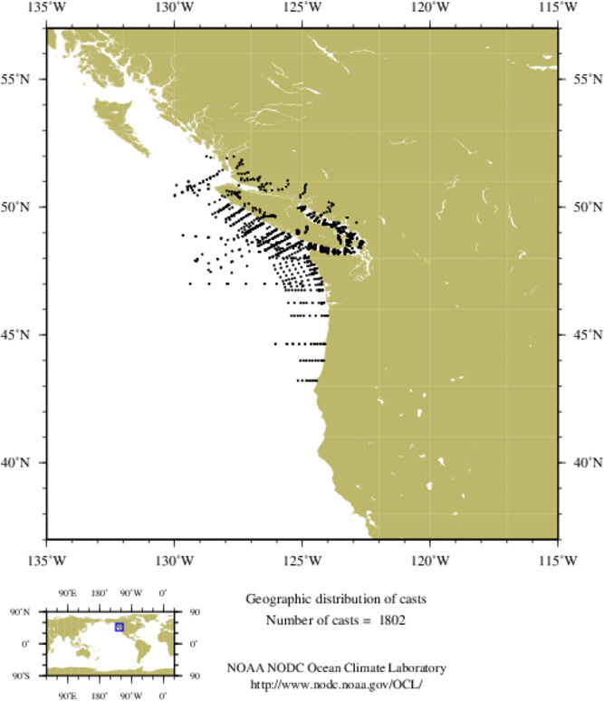

## README for WOD

#### This folder contain specific codes for processing bottle in Pacific North West from World Ocean Database

---

#### Source

- **WOD** Historic Data collected in Pacific North West.
- Data are publicly available at https://www.ncei.noaa.gov/products/world-ocean-database.  NOTE: I downloaded from the standard depths in **.nc** file year by year
  
  - ctd 
  - bottle 
 

  

Reference:

- Boyer, T.P., O.K. Baranova, C. Coleman, H.E. Garcia, A. Grodsky, R.A. Locarnini, A.V. Mishonov, C.R. Paver, J.R. Reagan, D. Seidov, I.V. Smolyar, K. Weathers, M.M. Zweng,(2018): World Ocean Database 2018. A.V. Mishonov, Technical Ed., NOAA Atlas NESDIS 87. https://www.ncei.noaa.gov/sites/default/files/2020-04/wod_intro_0.pdf Accessed 2023-12-22.

---

