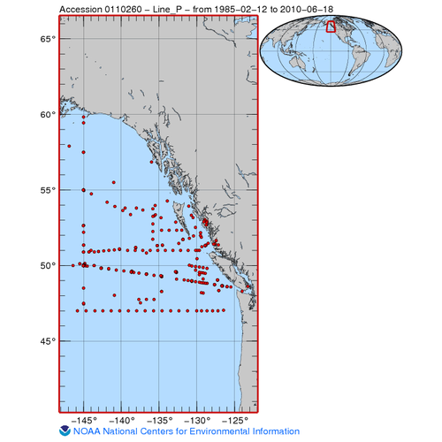

## README for nceiPNW

#### This folder contain specific codes for processing complied data in coastal Pacific Northwest 

---

#### Source

- **neciPNW** Historic Data collected in Pacific Northwest region by Department of Fisheries and Oceans Canada (DFO). 
- Data from 1985-2017 are publicly available at https://doi.org/10.3334/cdiac/otg.clivar_line_p_2009; the most recent version is 9.9
- or through this link: https://www.ncei.noaa.gov/data/oceans/ncei/ocads/data/0110260/
  
  - bottle 1985-2017
  - ctd 1985-2017: NONE PROCESSED

  

Reference:

- Miller, Lisa A.; Christian, James R.; Davelaar, Marty; Johnson, William K.; Linguanti, Joe (2013). Dissolved inorganic carbon (DIC), pH on total scale, total alkalinity, water temperature, salinity and other variables collected from discrete sample and profile observations during the R/Vs Endeavour, CCGS John P. Tully and Parizeau Line P cruises in the Coastal Waters of SE Alaska, Gulf of Alaska and North Pacific Ocean from 1985-02-12 to 2017-02-20 (NCEI Accession 0110260). NOAA National Centers for Environmental Information. Dataset. https://doi.org/10.3334/cdiac/otg.clivar_line_p_2009. Accessed [2023-12-30].

---

