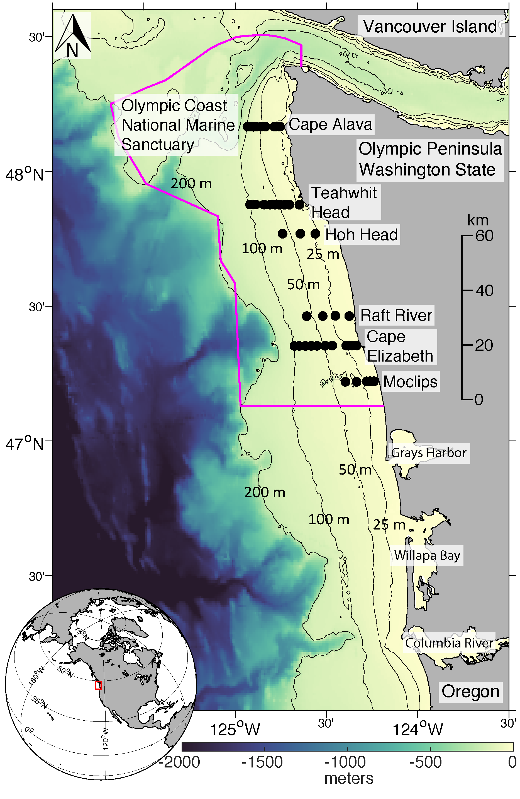

## README for OCNMS

#### This folder contains specific codes to process two separate CTD datasets collected from Olympic Coast National Marine Sanctuary (OCNMS), WA, since 2004-2023 
---

#### Source
- **OCNMS_ctd_01** Historic Cruise Data collected at Washington shelf waters used for mooring data quality control. Data are publicly available at https://zenodo.org/records/10466124 (Select "Olympic_Coast_National_Marine_Sanctuary_CTD_Data_2005_2023.zip" and then download)
  
  - bottle None
  - ctd 2005-2023, contains DO data.
 

- **OCNMS_ctd_02** Historic Cruise Data collected at the OCNMS region, including but not limited to mooring sites. Data are publicly available at https://zenodo.org/records/11167853 (Select "Olympic_Coast_National_Marine_Sanctuary_Hypoxia_Survey_CTD_Data_2004_2015.zip" and then download)

  - bottle None
  - ctd 2004-2015, contains DO data.

  

Reference:

- Risien, C.M., K.R. Hough, J. Waddell, M.R. Fewings, and B.T. Cervantes (2024). Hydrographic shipboard profile data collected within Olympic Coast National Marine Sanctuary, 2005–2023. Data in Brief, DOI: 10.1016/j.dib.2024.110171.

- Risien, C., Hough, K., Waddell, J., Fewings, M., & Cervantes, B. (2024). Shipboard Conductivity–Temperature–Depth (CTD) and dissolved oxygen profile data collected during hypoxia surveys along six hydrographic sampling lines within Olympic Coast National Marine Sanctuary, 2004–2015 (v1.0). Zenodo. https://doi.org/10.5281/zenodo.11167853

---

