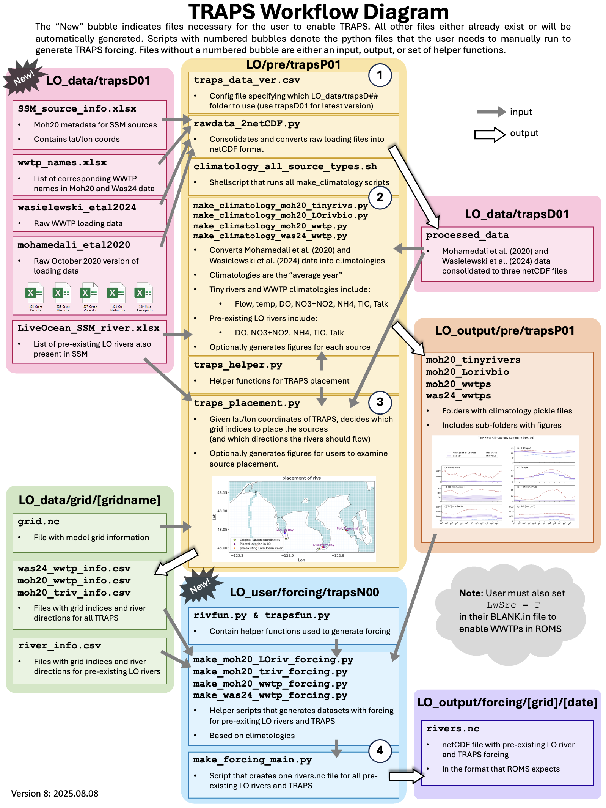
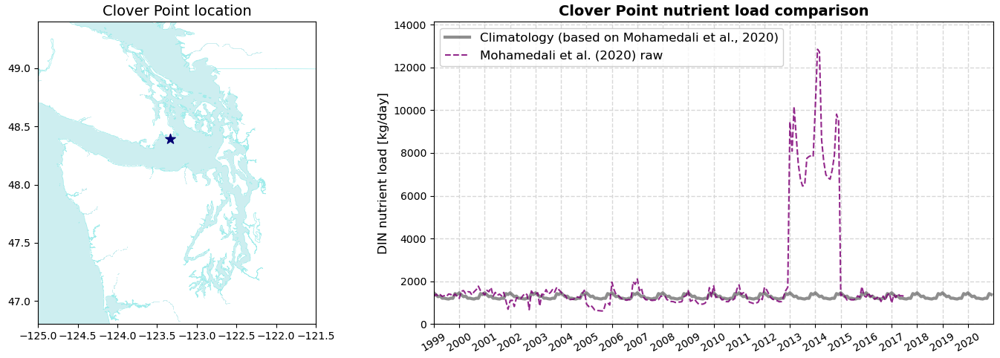

# LO_traps
 Module to add tiny rivers and point sources (TRAPS) to LiveOcean.

 ---
## Description

LO_traps is a module that contains all data and scripts required to add TRAPS to LiveOcean. Tiny rivers are defined as smaller rivers that do not already exist in LiveOcean. Point sources are anthropogenic point sources such as wastewater treatment plants and factories.

The TRAPS integration module is a work in progress. If you encounter any bugs or have general feedback, please email auroral@uw.edu. Thanks!

<!-- All data and source locations have been downloaded from Washington State Department of Ecology's [website](https://fortress.wa.gov/ecy/ezshare/EAP/SalishSea/SalishSeaModelBoundingScenarios.html). These data are also used in the Salish Sea Model. -->

For information on the data sources used and how they are handled in LiveOcean, please visit [LO/traps_notes/data_notes](https://github.com/parkermac/LO/tree/main/traps_notes/data_notes).

---
## Getting set up

<details><summary><strong>Where to put which files</strong></summary>

To enable TRAPS, you need to git pull on the LO repo to get the latest functional version of TRAPS on your local pc and remote machines.

The most important folders to look for are:

So you should have:
- LO/pre/trapsP01
- LO/forcing/trapsN00

Feel free to copy LO/forcing/trapsN00 into your LO_user repo, and modify as desired. The TRAPS workflow should still work fine.

</details>

<details><summary><strong>Additional required files</strong></summary>

The data used to generate TRAPS forcing is stored on Perigee.

On Apogee, copy the files in /dat1/auroral/LO_data/trapsD01 folder into LO_data/trapsD01 on your computer and whichever machine you will use to generate forcing (Perigee or Apogee). **You do not need to copy the folders titled "wasielewski_etal2024" and "mohamedali_etal2020". These folders contain raw data. The files in "processed_data" contain the condensed version of these data that are used by the TRAPS code**

Once this is complete you should have an LO_data/trapsD01 folder with the following files:
- **LiveOcean_SSM_rivers.xlsx:** Excel sheet with list of duplicate rivers in LiveOcean and the Salish Sea Model. When you create TRAPS climatology and when you generate forcing, the scripts will look at this excel sheet to determine which rivers to omit from LiveOcean. This ensures that TRAPS does not add duplicate rivers to LiveOcean.
- **wwtp_names.xlsx:** Excel sheet with list of WWTPs in the Mohamedali et al. (2020) and Wasielewski et al. (2024) datasets. The naming convention is slightly different between the two datasets, so this file is used to look up the different names for the same WWTPs.
- **SSM_source_info.xlsx:** Downloaded metadata from the Mohamedali et al. (2020) dataset
- **processed_data/river_data_mohamedali_etal_2020.nc**: Processed Mohamedali et al. (2020) imeseries data of state variables and lat/lon coordinates for all river mouths. Used in LO/pre/trapsP01 to generate climatology files.
- **processed_data/wwtp_data_mohamedali_etal_2020.nc**: Processed Mohamedali et al. (2020) imeseries data of state variables and lat/lon coordinates for all WWTPs. Used in LO/pre/trapsP01 to generate climatology files.
- **processed_data/wwtp_data_wasielewski_etal_2024.nc**: Processed Wasielewski et al. (2024) timeseries data of state variables and lat/lon coordinates for all WWTPs. Used in LO/pre/trapsP01 to generate climatology files and in LO/forcing/trapsN00 to generate forcing.

*Note: trapsD01 is the current version of data used to generate traps climatologies and forcing. Please see [LO/traps_notes/data_notes](https://github.com/parkermac/LO/tree/main/traps_notes/data_notes) for more information on thow these data were handled.

</details>

---
## Running TRAPS

After getting the required files, users should be able to add TRAPS to their model runs. An overview of the TRAPS workflow is shown below. Scroll past the figure for more detailed steps.

<details><summary><strong>TRAPS workflow diagram</strong></summary>

<p style="text-align:center;"></p>

</details>

<details><summary><strong>Run steps</strong></summary>

<details><summary>1. Specify data folder name</summary>
    
In LO/pre/trapsP01/traps_data_ver.csv, specify the version of LO_data you want to use to generate climatologies.

*Note that the latest WWTP upgrades are included in version trapsD01. The code is not backwards-compatible, so trapsP01 must be used with trapsD01 (you cannot mix trapsP01 with trapsD00).*

</details>

<details><summary>1.5. Convert raw data to netCDF</summary>
    
*Note: User does not need to run this step. It is listed here for completion. During TRAPS development and testing, the developer already ran this script. Users can skip to step 2. However, if the user decides to run this script, it is advised that they run it on their remote machine (or wherever they plan to generate forcing).*

This step runs one script which consolidates all data into netCDF files with daily resolution from Jan 1999 - Jul 2017 for Mohamedali et al. (2020) data, and Jan 2005 - Dec 2020 for Wasielewski et al. (2024) .data

These new files are stored in LO_data/processed_data.

</details>

<details><summary>2. Generate climatologies</summary>
    
This step generates climatology files for each of the TRAPS.
From your **remote machine** (or whichever machine you will use to generate forcing) in LO/pre/trapsP01:

```
bash climatology_all_source_types.sh
```
This shellscript runs climatology scripts for all source types (tiny rivers, pre-existing LiveOcean rivers, and WWTPs from both datasets).

Climatology pickle files will be generated and saved in four folders in LO_output/pre/trapsP##:

- **was24_wwtps:** Climatology files for WWTPs from Wasielewski et al. (2024)
- **moh20_wwtps:** Climatology files for WWTPs from Mohamedali et al. (2020)
- **moh20_tinyrivers:** Climatology files for tiny rivers from Mohamedali et al. (2020)
- **moh20_LOrivbio:** Climatology files for pre-existing LO rivers from Mohamedali et al. (2020)
  
If you want to look at timeseries figures of the climatologies, then run the following commands **on your local machine** from LO/pre/trapsP### in ipython:

```
run make_climatology_moh20_tinyrivs.py -test True
run make_climatology_moh20_LOrivbio.py -test True
run make_climatology_moh20_wwtp.py -test True
run make_climatology_was24_wwtp.py -test True
```

The "test" option will create a subfolder in LO_output/pre/trapsP01/[source type]/lo_base/Data_historical/climatology_plots with a climatology figure for each source. An example figure for Burley Creek is shown below.


</details>

<details><summary>3. Map TRAPS to the grid</summary>

This step uses the lat/lon coordinates of TRAPS to map each source to the nearest appropriate grid cell. Tiny rivers are mapped to the nearest coastal grid cell. Point sources are mapped to the nearest water cell. From your remote maching in LO/pre/trapsP01 in ipython:

```
run traps_placement.py -g [gridname]
```

Csv files with river directions and grid indices for the sources will be generated and saved in LO_data/grid/[gridname]

To look at where the TRAPS get mapped, run with ```-test True``` on your local machine. This option will create an interactive figure that you can zoom into. An example screenshot is shown below.


</details>

<details><summary>4. Generate TRAPS forcing</summary>

This step generates a rivers.nc files with forcing for all pre-existing LO rivers and TRAPS. It uses the climatologies generated in Step 2, and the grid indices and river directions generated in Step 3.

From your remote machine in LO/driver:

```
python driver_forcing3.py -g [gridname] -r backfill -s newcontinuation -0 2017.01.01 -1 2017.01.03 -tP trapsP## -f trapsN##
```

where trapsP## is the version of LO/pre/trapsP## you want to use (default to trapsP01).

Likewise, trapsN## is the traps forcing version you want to use.
(trapsN00 represented realistic conditions)

</details>

<details><summary>5. Run the model</summary>

Before running the model, make sure that you enable vertical sources in your dot in file. To do this, update the boolean option in your dot in file so:

```
LwSrc = T
```

This change is necessary because point sources are implemented as vertical sources using the LwSrc module.

After completing this change, run the model as you normally would.

</details>
</details>

---
## Exceptions and nuances in the code

<details><summary><strong>Fraser river NO4</strong></summary>

Ammonium (NO4) climatology generated from Ecology's data for the Fraser River is a constant value of 0.074 mmol/m3. This concentration is lower than I expected. Since the Fraser River is so large, it is important to get this value right. I reached out to Susan Allen at UBC to learn what NO4 concentration her group uses for the Fraser. She recommended a constant concentration of 4.43 mmol/m3 which is the mean measurement from Environmental Canada ([Olson et al, 2020](https://agupubs.onlinelibrary.wiley.com/action/downloadSupplement?doi=10.1029%2F2019JC015766&file=jgrc24099-sup-0001-Text_SI-S01.pdf)).

The 4.43 mmol/m3 NO4 concentration is implemented as an ```if``` statement in the depths of LO/forcing/trapsN00/make_moh20_LOriv_forcing.py code.


</details>

<details><summary><strong>Shifted rivers in Hood Canal</strong></summary>

Several Hood Canal rivers in Ecology's data, like Union River, get their flow data from the Big Beef Creek USGS river gage. However, the Big Beef Creek gage became inactive in mid-2012. As a result, from mid-2012 through the end of 2014, river data for these Hood Canal rivers are a copy of prior year data. These copied data also appear to be shifted by 3 months.

To prevent river climatologies from being biased by these shifted, copied data, I have removed data from mid-2012 through the end of 2014 for the affected Hood Canal rivers. This "data cropping" is implemented in LO_traps/user/pre/trapsP##/make_climatology_moh20_tinyrivs.py.

An example hydrograph for Union River is shown below before and after the data were cropped.


</details>

<!-- <details><summary><strong>WWTP open and close dates</strong></summary>

LO_data/trapsD00/wwtp_open_close_dates.xlsx is a user-modifiable sheet with the open and close dates of the WWTPs (with a yearly resolution). The information in this excel sheet is read by the LO_traps/user/forcing/trapsV##/make_wwtp_forcing.py script and turned into a series of ``if`` statements. When the user generates forcing for a year in which a WWTP is closed, then the scripts will still add the WWTP to the model grid. However, the script will set the discharge rate to be 0 m3/s.

</details> -->

<!-- <details><summary><strong>Overlapping sources and the Lake Stevens WWTPs</strong></summary>

For the cas7 grid, several pairs of tiny river and pairs of WWTPs get mapped to the same grid cell (despite having different lat/lon coordinates). These pairs of sources are called "overlapping" sources. To prevent ROMS from getting confused, the forcing scripts consolidate overlapping sources into a single source. The scripts sum the flowrates of both sources, and calculates a weighted average for the other state variables (e.g. temperature) based on flowrate. Even if users are not using the cas7 grid, the TRAPS forcing script will identify and consolidate overlapping sources. Note that this script can only consolidate a pair of overlapping tiny rivers, or a pair of overlapping WWTPs. The script is not able to identify whether a tiny river and WWTP are overlapping. Luckily, this scenario does not occur in the cas7 grid.

The Lake Stevens 001 and Lake Stevens 002 WWTPs overlap on the cas7 grid. However, these WWTPs are never open concurrently-- Lake Stevens 002 opens after Lake Stevens 001 closes. Thus, there is a conditional statement in the LO_traps/user/forcing/trapsV##/make_wwtp_forcing.py script that <i>un-</i>consolidates these WWTPs.

</details> -->

<details><summary><strong>Willamette River</strong></summary>

Willamette River is included in the Ecology data, and it is not explicitly a duplicate pre-existing LiveOcean river. However, Willamette River discharges into the Columbia River. The Columbia River was pre-existing to LiveOcean, and its USGS gauge is downstream of the Willamette River (meaning that the pre-existing Columbia River already includes contribution from the Willamette). Therefore, the TRAPS code needs to remove the Willamette River from being incorporated into LiveOcean.

This exception is handled in LO/pre/trapsP##/make_climatology_moh20_tinyrivs.py:


And also in LO/pre/trapsP##/traps_placement.py:


</details>

<details><summary><strong>Clover Point WWTP</strong></summary>

Data for Clover Point WWTP had seemingly anomalously high nutrient loads during 2013 - 2015. To prevent these data from biasing the Clover Point climatologies towards a higher-than-normal discharge, we omitted data from 2013 - 2015 prior to calculating climatologies. This case was handled in LO/pre/trapsP01/make_climatology_moh20_wwtp.py

The raw data for Clover Point WWTP, and our climatology with 2013 - 2015 data omitted are shown below:

<p style="text-align:center;"></p>

</details>

---
## Update Notes

<details><summary><strong>2025.08.08 update</strong></summary>

**Incoporated new WWTP loading dataset**

In this update, we incorporated a new WWTP loading dataset from [Wasielewski et al. (2024)](https://www.sciencebase.gov/catalog/item/64762b37d34e4e58932d9d81).

These data were combined with the prior Ecology data ([Mohamedali et al., 2020](https://fortress.wa.gov/ecy/ezshare/EAP/SalishSea/SalishSeaModelBoundingScenarios.html); October 2020 version) to improve WWTP loads. 

Please see [LO/traps_notes/data_notes](https://github.com/parkermac/LO/tree/main/traps_notes/data_notes). for more details on how these data were processed and consolidated.

All modules of the TRAPS code were updated to accomodate the new data integration.

The following file versions were updated:
- trapsD00 --> trapsD01
- trapsP00 --> trapsP01
- trapsF00 --> trapsN00

</details>

<details><summary><strong>2024.03.01 update</strong></summary>

**Fixed object type error and added climatology shellscript**

This update fixes a user-reported bug in the TRAPS forcing generation step. Previously, the object type for river_direction was inconsistent between tiny rivers and pre-existing LO rivers, which caused an error. Now, river_direction is defined as an int for both tiny rivers and pre-existing rivers, resolving the incompatible-type issue.

Additionally, I have added a shellscript in LO/pre/trapsP## called climatology_all_source_types.sh. This new script automates the climatology generation process so users no longer need to separately generate climatology for point sources, tiny rivers, and pre-existing LO rivers.

READMEs have been updated to reflect code changes.

Thanks to Parker for providing user feedback.

</details>

<details><summary><strong>2023.12.22 update</strong></summary>

**Improved naming convention**

Modified naming convention of folders containing different traps versions. TRAPS data start at trapsD00, and count up. TRAPS pre scrips start at trapsP00 and count up. TRAPS forcing scripts start at trapsF00 and count up.

The TRAPS scripts now also look at their current folder to get their respective version name.

As another small improvement, all TRAPS README's were moved to one central location in the LO repo. TRAPS subfolders all link to this central README folder.

</details>

<details><summary><strong>2023.11.28 update</strong></summary>

**LO integration**

Small changes to folder names and naming conventions to be consistent with the version of TRAPS that is integrated in LO.

</details>

<details><summary><strong>2023.09.04 update</strong></summary>

**Full code refactor**

Several improvements were made to the structure and clarity of the TRAPS code. These changes are intended to enhance TRAPS functionality and to make the code more accessible and readable for users.

</details>

<details><summary><strong>2023.01.05 update</strong></summary>

**Adding TRAPS climatology to pre-existing LO rivers**

Upon request, I have created and generated forcing for pre-existing LiveOcean rivers for which Ecology has data. These are all of the rivers in Ecology's dataset that are duplicates of LiveOcean rivers (and are thus not treated as a tiny river). As part of this update, I have created a new climatology script in LO_traps/pre/traps/make_climatology_LOrivbio.py to generate climatology for these duplicate rivers. I have also created a new folder LO_traps/user/forcing/traps1 with updated versions of make_forcing_main.py and trapsfun.py that use the new climatologies.

There are three confusing parts to the new code, listed below. As a user, it is not necessary to understand the details of these nuances to run the code.

1. Not all pre-existing LiveOcean rivers have a corresponding duplicate in Ecology's dataset. Thus, the file in LO_traps/data/LiveOcean_SSM_rivers.xlsx is frequently used to identify which of the pre-existing rivers do have Ecology data.
2. LiveOcean and Ecology's dataset use different names for the same rivers. Thus, there are several places in the code in which the name must be converted. When reading data and writing forcing for the pre-existing LiveOcean rivers, the LO name must be used. When generating climatology, or using climatology to create forcing, the Ecology/SSM name must be used. The helper function trapsfun.LO2SSM_name helps handle this conversion.
3. Some pre-existing LiveOcean rivers that have a corresponding duplicate in Ecology's dataset have weird values. I call them "weird rivers." Some characteristics include near-zero DO, negative TIC, and zero alkalinity. Rather than using Ecology's data for weird rivers, I have deferred to LiveOcean's default handling of these rivers. Thus, there are places within the code in which I subtract a list of "weird rivers" from the list of pre-existing, duplicate rivers.

</details>