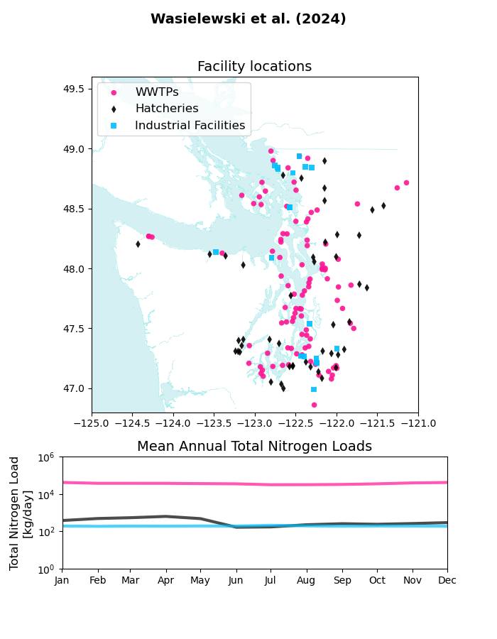
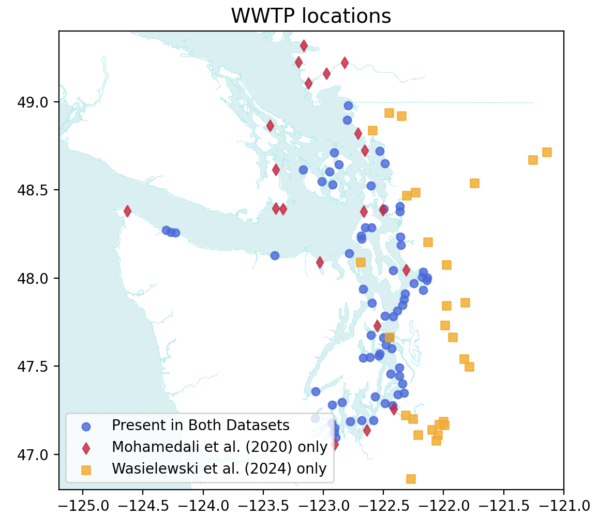
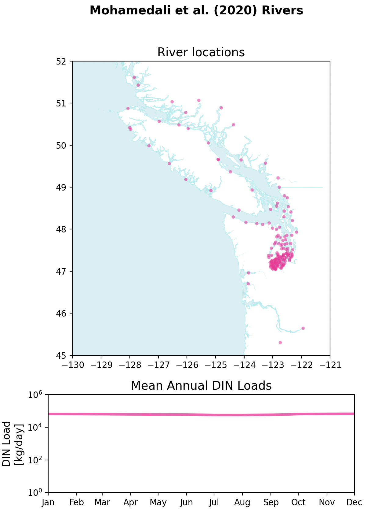
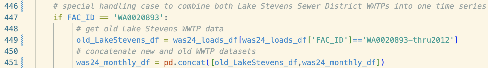

# Datasets

Two different datasets were combined in the latest (August 2025 version) Tiny River And Point Source (TRAPS) iteration.

## Wastewater Treatment Plants (WWTPs)

 

Mohamedali et al. (2020)

[**Data source**](https://fortress.wa.gov/ecy/ezshare/EAP/SalishSea/SalishSeaModelBoundingScenarios.html)

*Note that LiveOcean uses the October 2020 version of these data. A new June 2025 verson was developed by Ecology, but it is not used in LiveOcean.*

- **Dataset Description**: Monthly point source discharge, nutrient loads, temperature for WWTPs (n=89) and industrial facilities (n=10) discharging to both US and Canadian marine waters. Developed by Washington State Department of Ecology for input to the Salish Sea Model.
- **Dataset Timespan**: January 1999 - July 2017
- **LiveOcean Handling**:
    - Industrial facitlies are omitted from the LiveOcean integration.
    - All WWTPs from this dataset are included in LiveOcean
    - WWTP discharge and nutrient concentrations are updated to values from Wasielewski et al. (2024), if available.

Figure 1 depicts locations of all point sources in Mohamedali et al. (2020), and the mean annual dissolved inorganic nitrogen (DIN) load of each source type.

 Fig 1. Top panel: locations of WWTPs and industrial facilities in the Mohamedali et al. (2020) dataset. Bottom panel: climatology nutrient load profiles for the sum of each type of facilitiy (e.g., pink is the climatology for the sum of all WWTPs).
 

Wasielewski et al. (2024)

[**Data source**](https://www.sciencebase.gov/catalog/item/64762b37d34e4e58932d9d81)

- **Dataset Description**: Monthly point source nutrient discharge for WWTPs (n=97), industrial facilities (n=20), and fish hatcheries (n=47) discharging to Washington state watersheds. Developed by Washington State Department of Ecology and United States Geological Survey for input to a SPARROW watershed model.
- **Dataset Timespan**: January 2005 - December 2020
- **LiveOcean Handling**:
    - Industrial facitlies and fish hatcheries are omitted from the LiveOcean integration.
    - WWTPs are only incorporated into LiveOcean if the WWTp is also present in the Mohamedali et al. (2020) dataset. Any WWTP present in Wasielewski et al. (2024), but not Mohamedali et al. (2020), is omitted from LiveOcean.

Figure 2 depicts locations of all point sources in Wasielewski et al. (2024), and the mean annual total nitrogen (TN) load of each source type.
    

 Fig 2. Top panel: locations of WWTPs, industrial facilities, and fish hatcheries in the Wasielewski et al. (2024) dataset. Bottom panel: climatology nutrient load profiles for the sum of each type of facilitiy (e.g., pink is the climatology for the sum of all WWTPs).
 

 

Figure 3 depicts the locations of WWTPs across the two datasets. They are processed as follows:
- WWTPs in red are present ONLY in Mohamedali et al. (2020), and they ARE integrated into LiveOcean.
- WWTPs in blue are present in both datasets, and they ARE integrated into LiveOcean. Their lat/lon data come from Mohamedali et al. (2020), but their discharge and nutrient concentrations come from Wasielewski et al. (2024)
- WWTPs in yellow are present ONLY in Wasielewski et al. (2024), and they ARE NOT integrated into LiveOcean.

 Fig 3. Locations of WWTPs across the datasets.
 

---
## Rivers

Mohamedali et al. (2020)

[**Data source**](https://fortress.wa.gov/ecy/ezshare/EAP/SalishSea/SalishSeaModelBoundingScenarios.html)

*Again, note that LiveOcean uses the October 2020 version of these data. A new June 2025 verson was developed by Ecology, but it is not used in LiveOcean.*

- **Dataset Description**: Daily discharge, nutrient loads, temperature for rivers (n=161) discharging to both US and Canadian marine waters. Developed by Washington State Department of Ecology for input to the Salish Sea Model.
- **Dataset Timespan**: January 1999 - July 2017
- **LiveOcean Handling**:
    - Forty-five large rivers were already pre-existing in older versions of LiveOcean. Only data flow data for the tiny rivers are added to LiveOcean from this dataset.

Figure 4 depicts locations of all rivers in Mohamedali et al. (2020), and the mean annual dissolved inorganic nitrogen (DIN) load of each source type.

 Fig 4. Top panel: locations of rivers in the Mohamedali et al. (2020) dataset. Bottom panel: climatology nutrient load profiles for the sum of all rivers.
 

---
## Exceptions and nuances in data processing

Mohamedali et al. (2020)

- omitted industrial facilities
    - BP Cherry Point
    - Conoco Phillips
    - Intalco
    - Kimberly_Clark
    - Nippon Paper
    - Port Townsend Paper
    - Shell Oil
    - Tesoro
    - US Oil & Refining
    - West Rock
- omitted WWTPs that are also listed in Wasielewski et al. (2024)
    - which are listed in LO_data/trapsD01/wwtp_names.xlsx
- river lat/lon are averaged because some river mouths are split across two grid cells in SSM.

Wasielewski et al. (2024)

- omitted industrial facilities
- omitted fish hatcheries
- omitted WWTPs that are NOT also listed in Mohamedali et al. (2020)
- Used lat/lon locations from Mohamedali et al. (2020)
    - Names of the same WWTP in both datasets are listed in LO_data/trapsD01/wwtp_names.xlsx
    - Special cases where Wasielewski et al. (2024) used the same name for two different WWTPs:
        - 'Everett Water Pollution Control Facility'
            - ID=WA0024490_Gardner corresponds to Moh20's 'OF-100'
            - ID=WA0024490_Snohomish corresponds to Moh20's 'Everett Snohomish'
        - 'OAK HARBOR STP':
            - ID=WA0020567-001 corresponds to Moh20's 'Oak Harbor RBC', which we omit anyways because it stopped operating in 2010
            - ID=WA0020567-002 corresponds to Moh20's 'Oak Harbor Lagoon'
        
 
 

- This dataset has flow, nitrate, and ammonium data. but not temp, DO, TIC, and alkalinity
    - used climatology of these variables from Mohamedali et al. (2020) WWTPs as inputs for these WWTPs
        - note that all WWTPs in Mohamedali et al. (2020) uses the same values for all of these variables.
        - was careful about leap years and non-leap years
- Special case WWTPs:
    - removed Oak Harbor STP (WA0020567-001), which stopped operating in 2010
    - removed Lake Stevens Sewer Disctric (WA0020893-thru2012) and later combined flows with the newer Lake Stevens WWTP
    
 
 

    - padded end of Port Gamble WWTP (WA0022292) with zeros, because it was [decommisioned in 2017](https://ecology.wa.gov/blog/june-2017/around-the-sound-ongoing-and-future-restoration-r#:~:text=Decommissioning%20of%20the%20Port%20Gamble,be%20finished%20by%20March%202018.)

